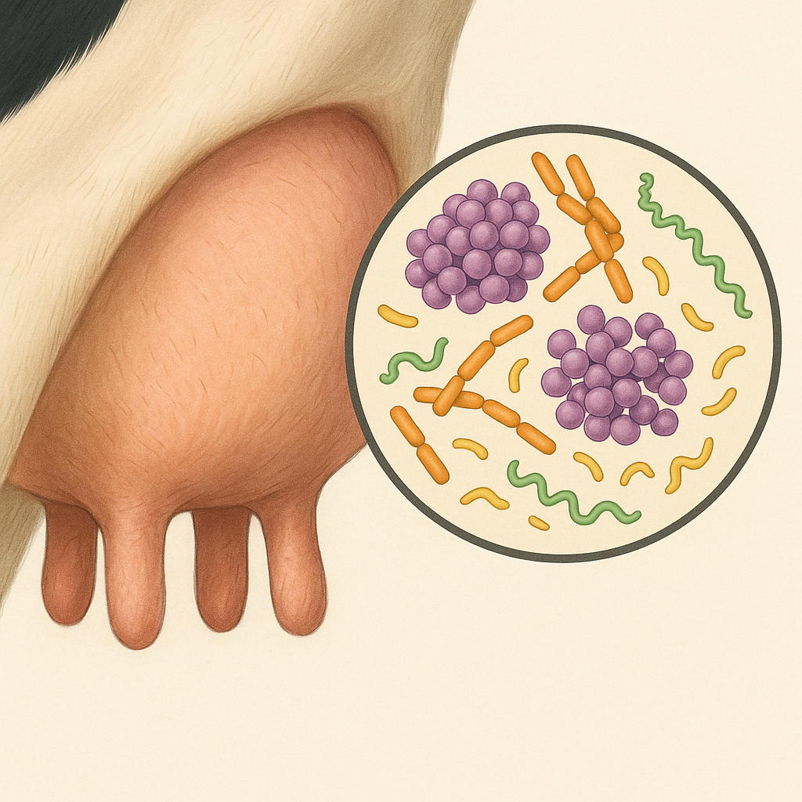

***

The objectives of this study were to characterize the teat canal microbiome of first-lactation organic dairy cows and to evaluate its association with the presence of intramammary infections during early postpartum, including whether shifts in microbial diversity or composition were related to existing or new infections.
 

